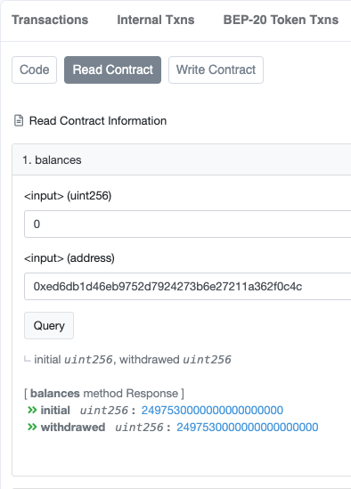

# User's Manual

### Table of contents

* [Which wallets you can use to buy tokens](#which-wallets-you-can-use-to-buy-tokens)
* [Creating a wallet](#creating-a-wallet)
* [Buying BNB](#buying-bnb)
* [Buying tokens](#buying-tokens)
* [Managing tokens](#managing-tokens)
* [Vesting](#vesting)
* [Balance](#balance)
* [Withdrawal](#withdrawal)

## Which wallets You can use to buy tokens
Tokens can be bought using wallets that support the standard BEP20.
The most common wallets are:
* Metamask
* Trust Wallet
* Binance Chain Wallet

## Creating a wallet
To participate in the sale You will need a wallet supporting BEP20.
If You do not already have one, we recommend using [Metamask](https://metamask.io/).

1. Go to [metamask.io](https://metamask.io/). Download the browser extension and follow the installation instructions.
2. Create an account (if You don't have one). [Here](https://docs.binance.org/smart-chain/wallet/metamask.html) you can find comprehensive instructions on how to configure your wallet to use the BSC network.

## Buying BNB
To participate in the sale you will need Binance Coins (BNB).
The easiest and most reliable way to purchase BNB is to buy them directly on the [Binance](https://www.binance.com) website.
There You can buy BNB using Visa or MasterCard bank cards.

During the purchase you might need the wallet address created on the previous step.

## Buying tokens
In order to buy tokens you need to send at least 23.786 BNB to the current crowdsale contract address: 

Before sending, make sure that:
1. You send at least 23.786 BNB (depending upon the configuration of the sales contract, this value may differ. See `minInvesmentLimit` of the corresponding sales stage [here](https://bscscan.com/address/#readContract)).
2. The amount of `gas` is greater than 250 000.
3. `Gas price` — at least 5 Gwei. Transactions with less gas price will take longer. Gas price may change over time.

If you are using Metamask, you need to do the following:
1. Open your Metamask wallet

2. Click `Send Transaction`. Select `amount` to send and sale contract [address](https://bscscan.com/address/). You can leave the `gas price` as is or specify your own.
    

Click to see screenshot

    

    
 

3. In the window that opens check again the `amount` to send and `address`. Click `Confirm`.
    

Click to see screenshot

    

    
 

## Managing tokens
To add tokens to your wallet, you need the following information:
* Token Contract Address - **[wip](https://bscscan.com/token/)**
* Token Symbol — **CARBO**
* Decimals — **18**
1. Open your MetaMask wallet, navigate to "Assets" tab and click "Add Token" button.
    

Click to see screenshot

    

    
 

2. Fill in the field `Token Contract Address`. Metamask will fill in the `Token Symbol` and the `Token Decimals` for you.
    

Click to see screenshot

   

    
 

3. Click `Add Tokens` on the next screen.
    

Click to see screenshot

   

    
 

4. You can now monitor your CARBO balance and transfer tokens directly from MetaMask.
    

Click to see screenshot

   

    
 

## Vesting
At the time of this writing, the vesting rules apply to tokens purchased in the first stage of the sale.
This means that the tokens remain on the sale contract after the purchase.
They can be withdrawed from the contract in accordance with the vesting schedule.
At the time of writing, the schedule assumes retrieving 10% of the purchase amount every month.
If the stage does not involve vesting, tokens are sent to the user's account immediately.

## Balance
At any time you can find out your balance and the amount already withdrawn from the contract.

Click to see screenshot

 

1. Go to the [Read Contract](https://bscscan.com/address/#readContract) tab of the sale smart contract.
2. Find the section `Balances`
3. Enter the number of the stage of the sale during which the purchase was made and enter your address in the BSC network.
4. Click the `Query` button

## AccountInfo
[VestingWallet](https://bscscan.com/address/#code) has the method called `getAccountInfo` to make it easier for the user to obtain information on the vested amount.  

Click to see screenshot

 

1. Enter your address in the `account` field
2. Click the `Query` button
3. Method returns three values:
   * the initial number of tokens locked on this contract
   * the number of tokens withdrawn
   * the number of tokens available for withdrawal at the moment

## Withdrawal
In order to receive vested tokens, You need to call the `withdraw` method of the [VestingWallet](https://bscscan.com/address/#code) smart contract.
1. Go to the [Write Contract](https://bscscan.com/address/#writeContract) tab of the sale smart contract.
2. Click `Connect to Web3` button to be able to call the smart contract methods using the bscscan interface.
3. Scroll down to the `withdraw` section.
    

Click to see screenshot

   

    
 
4. Click `Write` button
> Attention! If the conditions for withdrawing funds are not met (for example, you are trying to withdraw tokens too early, or there are no tokens on your balance, Metamask will display a warning: "Transaction Error. Exception thrown in contract code."
> This means that the transaction will fail and there is no point in calling it. Please clarify the vesting conditions and wait until your tokens are available for withdrawal.
